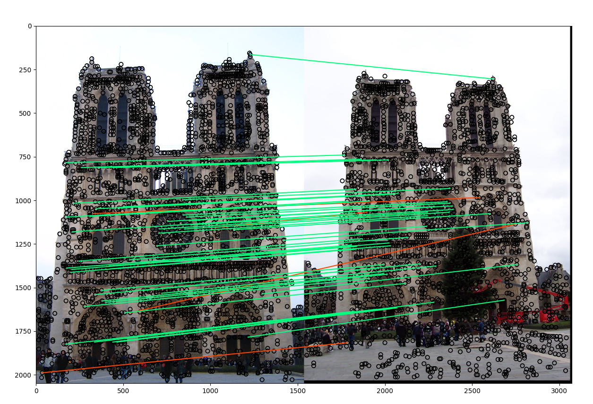
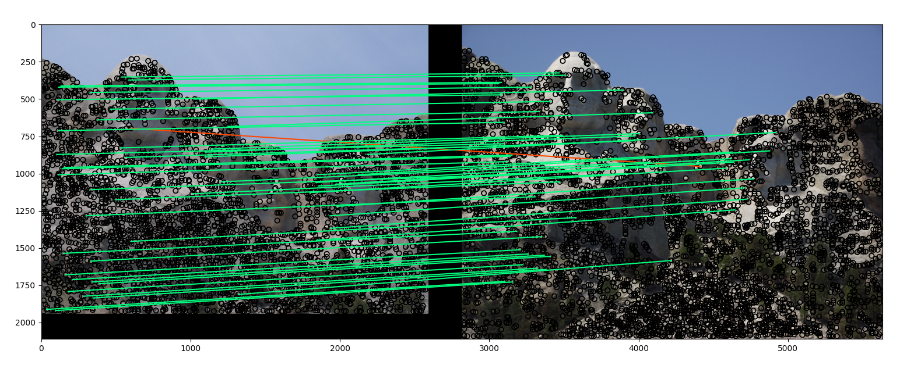
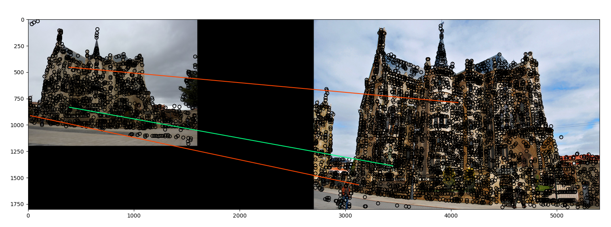

# Digital Image Processing and Computer Vision
## Assignment 2: Local Feature Matching
Implement Harris Corner Detector, Scale-Invarient feature transform (SIFT), Nearest Neighbor Distance Ratio

## Result

```Getting interest points...
alpha: 0.06, threshold: 0.01, stride: 2, sigma: 0.1, sigma0: 0.1, min_distance: 3
alpha: 0.06, threshold: 0.01, stride: 2, sigma: 0.1, sigma0: 0.1, min_distance: 3
Done!
Getting features...
sigma_gradient_image: 0.1, sigma_16x16: 0.4, threshold: 0.2
sigma_gradient_image: 0.1, sigma_16x16: 0.4, threshold: 0.2
Done!
Matching features...
threshold: 0.8
Done!
Matches: 134
Accuracy on 50 most confident: 92%
Accuracy on 100 most confident: 83%
Accuracy on all matches: 82%
```


```Getting interest points...
alpha: 0.06, threshold: 0.01, stride: 2, sigma: 0.1, sigma0: 0.1, min_distance: 3
alpha: 0.06, threshold: 0.01, stride: 2, sigma: 0.1, sigma0: 0.1, min_distance: 3
Done!
Getting features...
sigma_gradient_image: 0.1, sigma_16x16: 0.4, threshold: 0.2
sigma_gradient_image: 0.1, sigma_16x16: 0.4, threshold: 0.2
Done!
Matching features...
threshold: 0.8
Done!
Matches: 168
Accuracy on 50 most confident: 98%
Accuracy on 100 most confident: 99%
Accuracy on all matches: 96%
```


```Getting interest points...
Getting interest points...
alpha: 0.06, threshold: 0.01, stride: 2, sigma: 0.1, sigma0: 0.1, min_distance: 3
alpha: 0.06, threshold: 0.01, stride: 2, sigma: 0.1, sigma0: 0.1, min_distance: 3
Done!
Getting features...
sigma_gradient_image: 0.1, sigma_16x16: 0.4, threshold: 0.2
sigma_gradient_image: 0.1, sigma_16x16: 0.4, threshold: 0.2
Done!
Matching features...
threshold: 0.8
Done!
Matches: 3
Accuracy on all matches: 33%
```